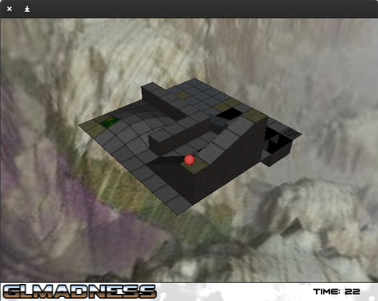
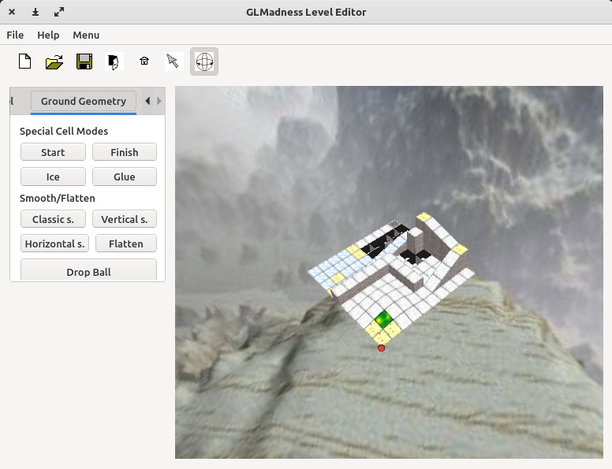

# GLMadness



This is some old code I developed as final project for an university class I attended in 2005. Essentially, it is a stripped-down OpenGL version of [Marble Madness](https://en.wikipedia.org/wiki/Marble_Madness) that allows full 3D view of the game scene. 

It also includes a level editor with a GUI in [Qt](https://en.wikipedia.org/wiki/Qt_(software)). 



The class assignment was to start from a given skeleton, which provided basic 3D manipulation functions and simple widgets, and build both the player and the editor on top of it. The class later re-used some of that skeleton code (particularly the VCG Library) to start [MeshLab](https://github.com/cnr-isti-vclab/meshlab/tree/main/src) as team assignment for another similar university class, taught by the same Professor.

## Gameplay

You win if you manage to drive the ball from the start tile to the finish tile before the time is over.

You use the mouse to drive the ball; press the left mouse button while the cursor is over the ball, then move the cursor and release the button. The direction and the speed of the cursor will be passed to the ball and will add to any motion vector the ball might have already. This means you can slow down the ball or adjust its direction while it's moving.

There are 2 special types of tiles affecting how the ball rolls once it passes over them:

- glue: the motion vector is reduced by a certain factor; so the ball slows down and it's likely to stop. Making it move while over the glue requires extra pushes so you have to move the mouse faster
- ice: the motion vector is amplified by a certain factor; so the ball slides and it's more difficult to control

The game is over if:
- the ball falls outside of the plane; this includes tiles that have a negative height (holes)
- the ball falls from too high and cracks
- the timer is over before the ball reaches the finish tile

You can use the cursor keys to change your point of view and PageUp/PageDown to zoom in/out.

## Why?

No particular reason but curiosity. I ran into an old archive while looking for something unrelated; I wanted to see if I could make this game run again after 18 years so I decided to spend some time playing with this very old code.

This is C++ that was written on Visual Studio 2003, using [SDL](https://www.libsdl.org/), [Glew](https://glew.sourceforge.net/), Qt 3 and some other library. 

I had absolutely no intention to recreate such environment to just compile this code; instead, I wanted to see how hard would it be to build it by using only packages available in a modern Linux distro.

I've also tried to preserve the original code as much as possible; so bugs, bad indentation, weird comments... it's all there untouched, in the first commit to main.

## Repo structure

This repo contains:

- `bmf`: bitmap font library (from 2003! Unsurprisingly, I could not find where this came from)
- `CI`: 3D classes, functions and utilities (CI was the university class name)
- `data`: images used in the game
- `levels`: playable game levels created with the level editor
- `MM`: game-specific classes, used by both the player and the editor
- `SDLMM`: game player (based on SDL)
- `QTMM`: level editor (based on Qt)
- `vcg`: some classes taken from the [Visual Computing Group library](https://github.com/cnr-isti-vclab/vcglib) 

## Porting

Many `#includes` had to be fixed due to Windows being case insensitive on filenames, unlike Linux. 

Qt changed significantly since Qt3; `.ui` files used in the level editor were rejected entirely by recent version of `uic`. Qt4 shipped with the handy tool `uic3` to convert `.ui` files; unfortunately Qt4 is also long gone from modern distros, so I had to resort to an old Debian installation which still [includes](https://packages.debian.org/buster/libqt4-dev-bin) this tool. This helped, but several manual fixes to the converted files were still needed. Plus, some methods had changed signature, some enums were replaced; overall Qt was the most time consuming to port.

SDL2 breaks SDL1.2 API, but fortunately SDL1.2 is still shipped by modern distributions so no code had to be ported.

`.pro` files were replaced entirely by `CMakeLists.txt`; quite straightforward thanks to the great Qt support provided by CMake.

## Building

On Debian and friends, is as simple as:

```
apt install build-essential cmake libqt5opengl5-dev libglew-dev libsdl1.2-dev
cd glmadness/SDLMM
mkdir Debug && cd Debug
cmake ..
ls -l SDLMM
cd ../../QTMM
mkdir Debug && cd Debug
cmake ..
ls -l QTMM
```

Then just run the game:

```
cd glmadness/SDLMM
./Debug/SDLMM -nofs
```

or the level editor:

```
cd glmadness/QTMM
./Debug/QTMM
```

## License

This software is reelased under the terms of GNU Public License v3 (see included LICENSE file), unless otherwise indicated in the header of a specific file.